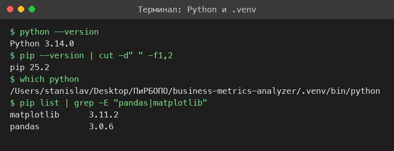
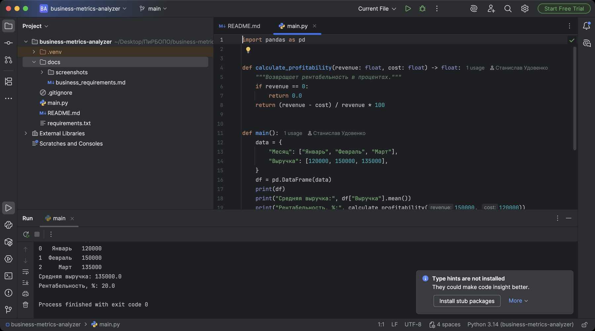
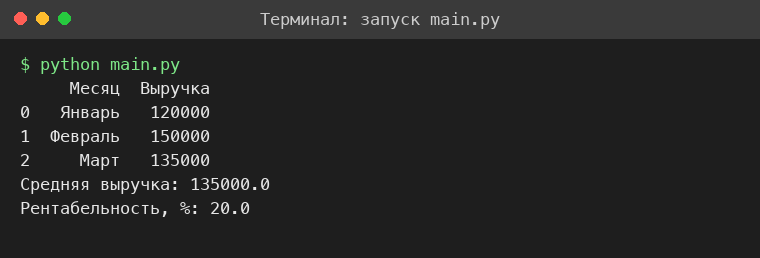
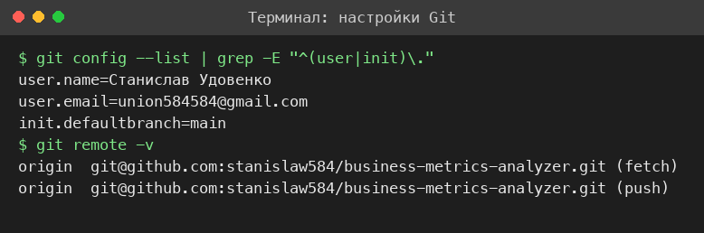
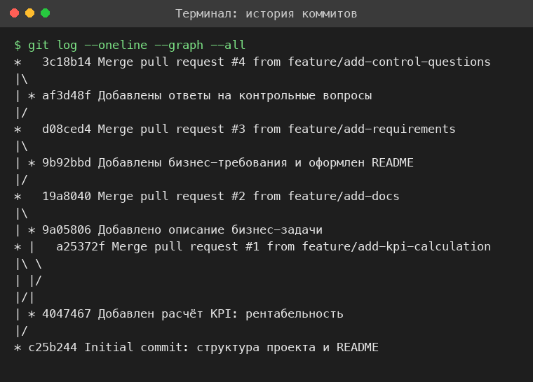
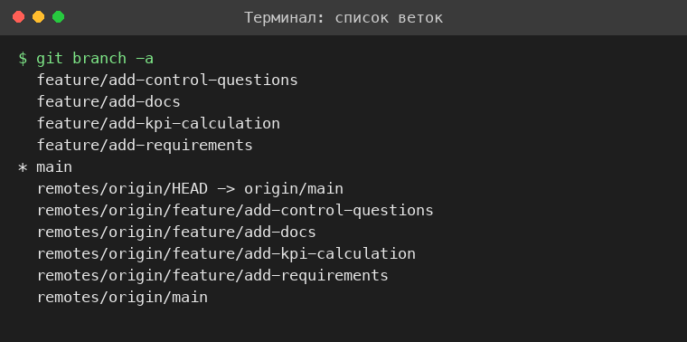
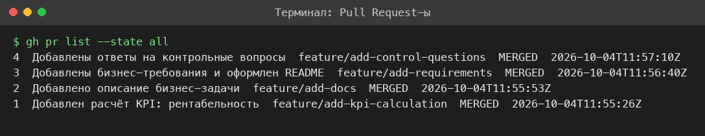
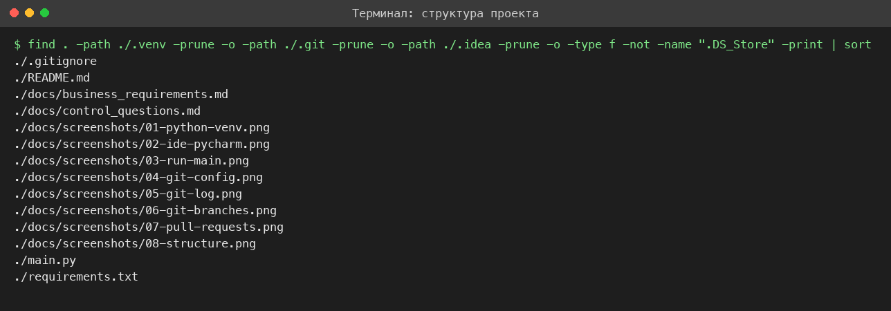

# Business Metrics Analyzer

Учебный проект по дисциплине «Проектирование и разработка бизнес-ориентированного программного обеспечения».

## Бизнес-задача

Расчёт и визуализация ключевых показателей эффективности (KPI) предприятия: выручки, рентабельности и динамики показателей по месяцам.

## Используемые технологии

- Python 3.12+
- pandas
- matplotlib
- Git и GitHub (ветки, Pull Request)

## Планируемые метрики

- Выручка по месяцам и средняя выручка.
- Рентабельность, %.
- Динамика показателей (график matplotlib).

## Инструкция по запуску

```bash
python -m venv .venv
source .venv/bin/activate  # или .venv\Scripts\activate для Windows
pip install -r requirements.txt
python main.py
```

## Структура проекта

```text
business-metrics-analyzer/
├── .gitignore
├── README.md
├── requirements.txt
├── main.py
└── docs/
    ├── business_requirements.md
    ├── control_questions.md
    └── screenshots/
```

## Документация

- [Бизнес-требования](docs/business_requirements.md)
- [Ответы на контрольные вопросы](docs/control_questions.md)

## Результаты выполнения

### Python и виртуальное окружение



### Настройка IDE (PyCharm)



### Запуск main.py



### Настройки Git



### История коммитов



### Ветки



### Pull Request-ы



### Итоговая структура проекта



## Автор

Студент группы Б1123-38.03.05ба, Удовенко Станислав Романович.
